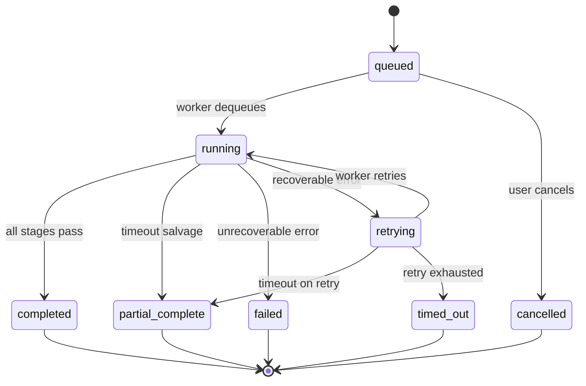
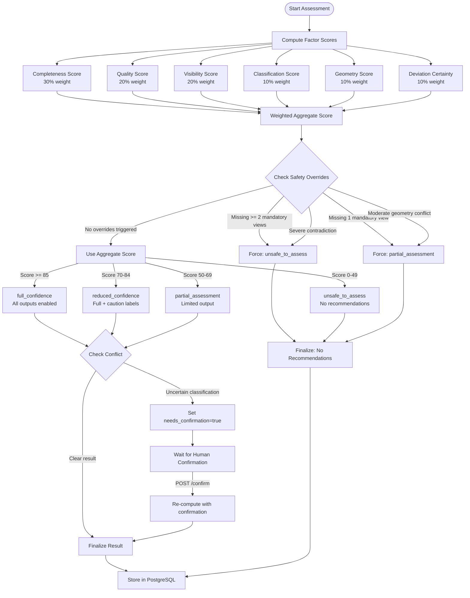
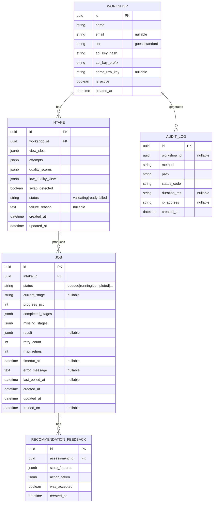
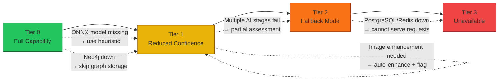
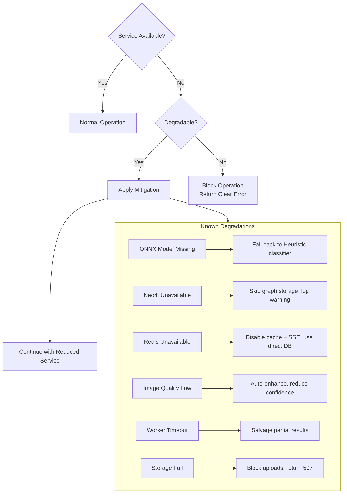
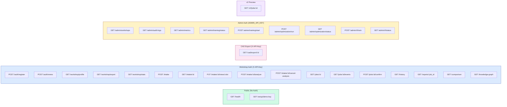

# RetroMind AI — Architecture & Workflow Diagrams

> All diagrams use Mermaid.js syntax and render natively on GitHub.

---

## 1. Deployment Topology

```mermaid
graph TB
    subgraph Internet
        User([Workshop User])
        Admin([Platform Admin])
    end

    subgraph "Oracle Cloud Free Tier VM (4 OCPU, 24 GB RAM)"
        subgraph ReverseProxy["Caddy Reverse Proxy"]
            CADDY[Caddy :80 / :443<br/>Auto Let's Encrypt TLS]
/main
/main
        end

        subgraph DockerCompose["Docker Compose Services"]
            FE[Frontend<br/>Next.js Standalone<br/>:3000]
            API[Backend API<br/>FastAPI uvicorn<br/>:8000]
            WK[Worker<br/>RQ Multi-Process<br/>Concurrency=N]

            PG[(PostgreSQL 16<br/>:5432)]
            RD[(Redis 7<br/>:6379)]
            N4J[(Neo4j Community<br/>:7687 / :7474)]
        end

        UV[Local Upload Storage<br/>/app/uploads/]
    end

    User -->|HTTPS :443| CADDY
    Admin -->|HTTPS :443| CADDY
    CADDY -->|/api/*| API
    CADDY -->|/*| FE
/main
    User -->|HTTPS :443| NGINX
    Admin -->|HTTPS :443| NGINX
    NGINX -->|/api/*| API
    NGINX -->|/*| FE
>>>>>>> origin/main
/main
/main
    style FE fill:#c084fc,stroke:#6b21a8
    style API fill:#f472b6,stroke:#9d174d
    style WK fill:#fb923c,stroke:#9a3412
    style PG fill:#3b82f6,stroke:#1e3a5f
    style RD fill:#ef4444,stroke:#7f1d1d
    style N4J fill:#22d3ee,stroke:#155e75
    style UV fill:#e2e8f0,stroke:#64748b
    style AI fill:#a78bfa,stroke:#5b21b6
```

---

## 2. Component Architecture

```mermaid
graph TB
    subgraph Frontend["Frontend (Next.js 14 + Tailwind + Three.js)"]
        PAGES[Pages]
        COMP[Components]
        HOOKS[Hooks]
        UTILS[Utilities]

        PAGES -->|app/page.tsx| Work[Assessment Workspace]
        PAGES -->|app/auth| Auth[Auth Page]
        PAGES -->|app/history| Hist[History]
        PAGES -->|app/analytics| Analytics[Analytics]
        PAGES -->|app/settings| Settings[Settings]
        PAGES -->|"app/reports/[id]"| Reports[Reports]
        PAGES -->|app/admin| Admin[Admin Dashboard]
        PAGES -->|app/compare| Compare[Side-by-Side]
        PAGES -->|app/knowledge-graph| KG[Knowledge Graph]

        COMP --> Assessment[Assessment Components]
        COMP --> DigitalTwin[Digital Twin 3D]
        COMP --> AuthGuard[Auth Guard]
        COMP --> AppShell[App Shell]
        COMP --> Header[Nav Header]

        HOOKS --> useAssessment[useAssessment]
        HOOKS --> useJobPolling[useJobPolling]
        HOOKS --> useJobSSE[useJobSSE]

        UTILS --> ApiClient[API Client]
        UTILS --> ApiKey[API Key Mgmt]
    end

    subgraph Backend["Backend API (FastAPI)"]
        MMWare[Middleware Stack]
        ROUTES[Route Handlers /api/v1/*]
        V2[Route Handlers /api/v2/*]
        CORE[Core Domain Logic]
        AI[AI Modules]

        MMWare --> RateLimit[Rate Limiter]
        MMWare --> Audit[Audit Logger]
        MMWare --> Metrics[Prometheus Metrics]
        MMWare --> CORSMiddleware
        MMWare --> Version[Accept-Version Header]

        ROUTES --> authEP[auth: register/renew]
        ROUTES --> intakeEP[intake: upload/validate]
        ROUTES --> jobsEP[jobs: poll/confirm/SSE]
        ROUTES --> historyEP[history: list]
        ROUTES --> analyticsEP[analytics: stats]
        ROUTES --> reportsEP[reports: compliance]
        ROUTES --> adminEP[admin: workshops/audit]
        ROUTES --> trainingEP[training: ML pipeline]
        ROUTES --> healthEP[health / metrics / demo]

        CORE --> Auth[API Key Auth]
        CORE --> Confidence[Confidence Engine]
        CORE --> Risk[Risk Model]
        CORE --> Compliance[Compliance State Machine]
        CORE --> Config[Pydantic Settings]
        CORE --> SSE[SSE Pub/Sub]

        AI --> Classifier[Vehicle Classifier<br/>PyTorch → ONNX → Heuristic]
        AI --> Geometry[Geometry Extraction]
        AI --> Deviation[Deviation Detection]
        AI --> Training[ML Training Pipeline<br/>PyTorch + TorchScript]
        AI --> Downscale[Image Downscaling]
        AI --> Generative[GenerativeRefiner<br/>OpenAI / Anthropic]
        AI --> RlAgent[RLRecommendationAgent<br/>PPO on Template]
    end

    subgraph OptionalServices["Optional Services (flag-gated, off by default)"]
        OP_TRAIN[Training Scheduler<br/>1h retrain loop]
        OP_FREECAD[FreeCAD Worker<br/>STEP/STL export]
        OP_OPTUNA[Optuna Studies<br/>Hyperparameter tuning]
    end

    subgraph Worker["Background Worker (RQ + Multiprocessing)"]
        WK_MAIN[Worker Launcher<br/>Concurrency=N]
        WK_ASSESS[Assessment Pipeline]
        
        WK_ASSESS --> Stage1[1. Upload Validation]
        WK_ASSESS --> Stage2[2. Image Quality Check]
        WK_ASSESS --> Stage3[3. Vehicle Classification<br/>ONNX / Heuristic]
        WK_ASSESS --> Stage4[4. Geometry Extraction<br/>OpenCV]
        WK_ASSESS --> Stage5[5. Deviation Detection<br/>OpenCV]
        WK_ASSESS --> Stage6[6. Feasibility Scoring<br/>Confidence Engine]
        WK_ASSESS --> Stage7[7. Risk Analysis]
        WK_ASSESS --> Stage8[8. Battery Optimization]
        WK_ASSESS --> Stage9[9. Wiring Guidance]
        WK_ASSESS --> Stage10[10. Digital Twin Data]
        WK_ASSESS --> Stage11[11. Finalize + Store]
    end

    subgraph Storage["Data Stores"]
        PG[(PostgreSQL<br/>Workshops, Intakes,<br/>Jobs, Audit Logs)]
        RD[(Redis<br/>Job Queue, Cache,<br/>SSE Pub/Sub)]
        N4J[(Neo4j<br/>Retrofit DNA Graph)]
        FS[(Filesystem<br/>Uploaded Images,<br/>Exports)]
    end

    Frontend -->|HTTP REST| Backend
    Backend -->|SQLAlchemy| PG
    Backend -->|redis-py| RD
    Backend -->|file I/O| FS
    
    Worker -->|dequeue/pubsub| RD
    Worker -->|SQLAlchemy| PG
    Worker -->|bolt| N4J
    Worker -->|file I/O| FS
    Worker -->|in-process| AI

    style Frontend fill:#dbeafe,stroke:#1e40af
    style Backend fill:#fce7f3,stroke:#9d174d
    style Worker fill:#ffedd5,stroke:#9a3412
    style Storage fill:#f0fdf4,stroke:#166534
```



---

## 3. Full Assessment Workflow

```mermaid
sequenceDiagram
    participant U as Workshop User
    participant F as Frontend
    participant A as Auth System
    participant B as Backend API
    participant R as Redis
    participant W as Worker
    participant P as PostgreSQL
    participant N as Neo4j

    Note over U,N: === PHASE 1: AUTHENTICATION ===

    U->>F: Open browser
    alt Has stored key
        F->>A: Validate X-API-Key
        A-->>F: workshop_id
    else No key
        F->>U: Show auth page
        F->>B: GET /api/v1/setup/demo-key
        B-->>F: { api_key }
        Note over F: Or user registers or pastes existing key
        F->>A: Store key in localStorage
    end

    Note over U,N: === PHASE 2: INTAKE ===

    U->>F: Navigate to assessment page
    F-->>U: Show 6 upload slots
    U->>F: Upload photos (3 required + optional)
    
    par Upload left_side_profile
        F->>B: PUT /intake/{id}/views/left_side_profile
        B->>B: Validate format, scan for blur
        B-->>F: { status, quality_score }
    and Upload right_side_profile
        F->>B: PUT /intake/{id}/views/right_side_profile
    and Upload rear_view
        F->>B: PUT /intake/{id}/views/rear_view
    end

    B->>B: Detect left/right swap
    alt Swap detected
        B-->>F: { swap_suspected: true }
        F-->>U: "Left/right sides appear swapped. Confirm or re-upload?"
    end

    Note over U,N: === PHASE 3: ANALYSIS ===

    U->>F: Click "Start Assessment"
    F->>B: POST /intake/{id}/analyze
    B->>R: Enqueue assessment job
    B-->>F: { job_id, status: "queued" }

    R->>W: Dequeue job
    W->>P: Update job status = "running"

    loop Poll every 2-5s (or SSE stream)
        alt SSE stream
            F->>B: GET /jobs/{id}/events (SSE)
            B->>R: Subscribe to pub/sub channel
            R-->>B: job.progress events
            B-->>F: SSE: { status, stages, result? }
        else Polling
            F->>B: GET /jobs/{id} (poll)
            B->>R: Try cache
            alt Cache hit
                R-->>B: Cached result
            else Cache miss
                B->>P: Query job
                P-->>B: Job data
                B->>R: Set cache (TTL=2s)
            end
            B-->>F: { status, stages, result? }
        end

        W->>W: Stage 1: Upload Validation
        W->>R: PUBLISH job.progress: "validating"

        W->>W: Stage 2: Image Quality Check
        W->>R: PUBLISH job.progress: "checking quality"

        W->>W: Stage 3: Vehicle Classification
        alt PyTorch enabled & model loaded
            W->>W: PyTorch (MobileNetV3) inference
        else ONNX model exists
            W->>W: ONNX inference → vehicle type + confidence
        else Heuristic fallback
            W->>W: OpenCV contour analysis → vehicle type
        end
        W->>R: PUBLISH job.progress: "classified"

        W->>W: Stage 4: Geometry Extraction
        W->>W: OpenCV → aspect ratio, solidity, bounding box
        W->>R: PUBLISH job.progress: "geometry extracted"

        W->>W: Stage 5: Deviation Detection
        W->>W: Edge comparison, symmetry analysis
        W->>R: PUBLISH job.progress: "deviations detected"

        W->>W: Stage 6: Confidence Scoring
        W->>W: Weighted factors + safety overrides → state
        W->>R: PUBLISH job.progress: "confidence scored"
    end

    alt Confidence >= 85 (Full)
        W->>W: Proceed all recommendations
    else 70-84 (Reduced)
        W->>W: Full recommendations + caution labels
    else 50-69 (Partial)
        W->>W: Limited output, preliminary only
    else 0-49 (Unsafe)
        W->>W: No recommendations, required actions
    end

    Note over W: Stage 7: Risk Analysis (RL agent adjusts priorities if enabled, else template engine)
    W->>W: Stage 8: Battery Optimization (GenerativeRefiner pass-through if enabled)
    W->>W: Stage 9: Wiring Guidance (GenerativeRefiner pass-through if enabled)
    W->>W: Stage 10: Digital Twin Data
    W->>W: Stage 11: Finalize Result

    W->>P: Store { status, result, confidence, risks, recommendations }
    W->>N: Store Retrofit DNA record
    W->>R: PUBLISH job.completed
    W->>R: PUBLISH job.progress: "completed"

    B-->>F: Final poll returns { status: "completed", result }
    F-->>U: Display full assessment

    Note over U,N: === PHASE 4: CONFIRMATION (if needed) ===

    alt needs_confirmation == true
        F-->>U: Show confirmation dialog
        U->>F: Select correct vehicle type
        F->>B: POST /jobs/{id}/confirm
        B->>P: Re-run confidence with confirmation
        P-->>B: Updated assessment
        B-->>F: { result }
        F-->>U: Updated assessment view
    end

    Note over U,N: === PHASE 5: REPORT & ACTIONS ===

    U->>F: Click "View Report"
    F->>B: GET /reports/{job_id}
    B->>P: Fetch job with full result
    B-->>F: 13-section compliance report

    U->>F: Explore digital twin (3D)
    U->>F: View risks and recommendations
    U->>F: Export report JSON
    U->>F: Navigate to knowledge graph
    F->>B: GET /knowledge-graph
    B->>N: Similarity query
    N-->>B: Related retrofits
    B-->>F: Graph data
    F-->>U: Visualized Neo4j graph
```



---

## 4. Job State Machine



---

## 5. Assessment Stages (Progressive Disclosure)

```mermaid
gantt
    title Assessment Pipeline (Target: 60s)
    dateFormat  X
    axisFormat %s

    section Pre-Processing
    Upload Validation        : 0, 1s
    Image Quality Check      : 1, 2s

    section Core AI
    Vehicle Classification   : 3, 15s
    Geometry Extraction      : 18, 12s
    Deviation Detection      : 30, 15s

    section Scoring
    Feasibility Scoring      : 45, 2s
    Risk Analysis            : 47, 2s

    section Recommendations
    Battery Optimization     : 49, 8s
    Wiring Guidance          : 57, 4s
    Digital Twin Data        : 61, 3s

    section Finalization
    Finalize + Store         : 64, 2s
```



---

## 6. Confidence Engine Decision Flow



---

## 7. Database Schema (ER)



---

## 8. Degradation Tiers



---

## 9. Infrastructure Degradation Flow



---

## 10. API Route Map


