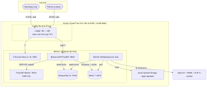
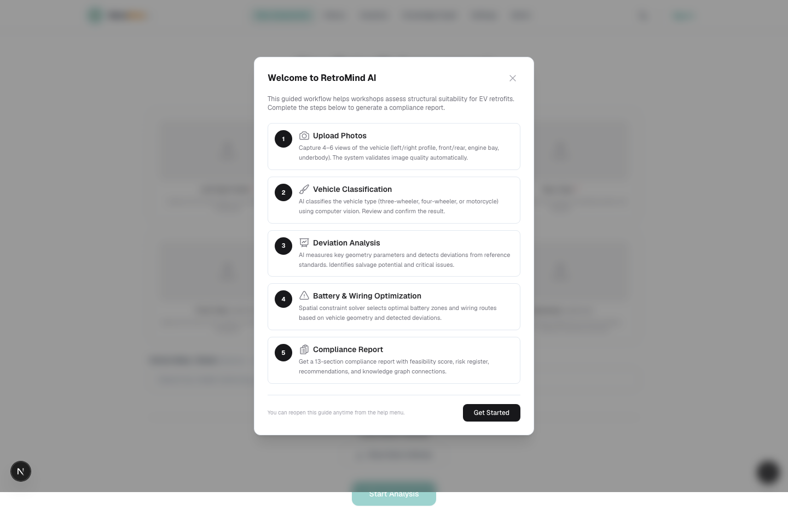
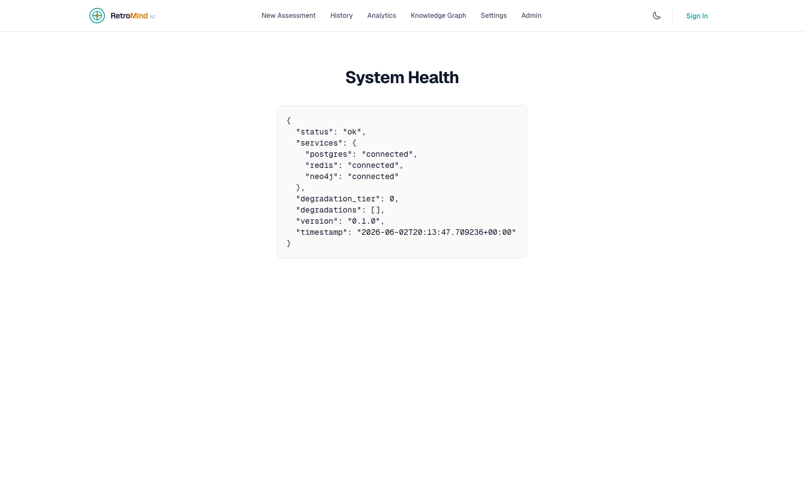
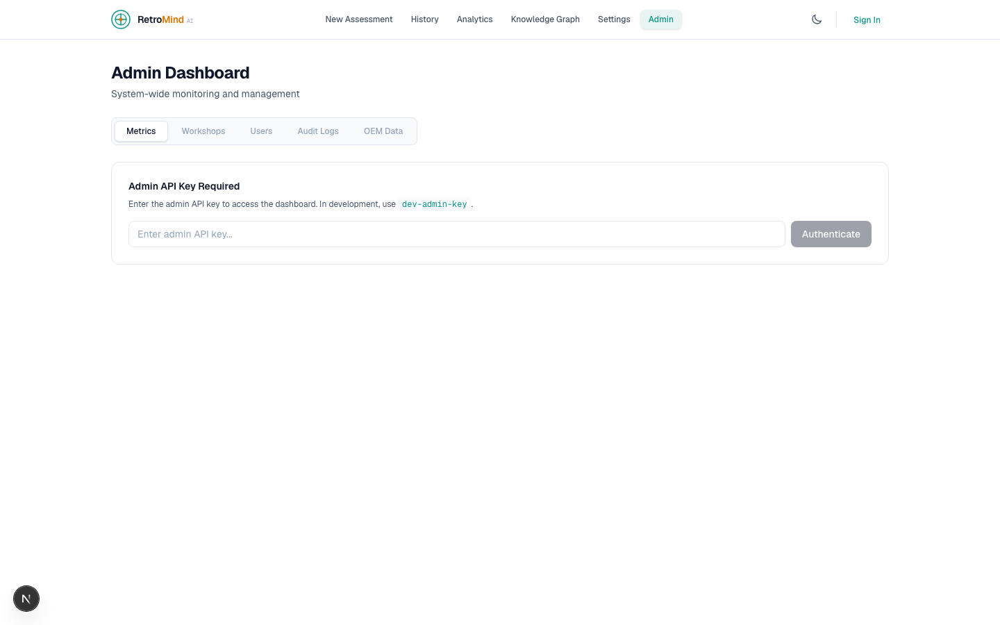
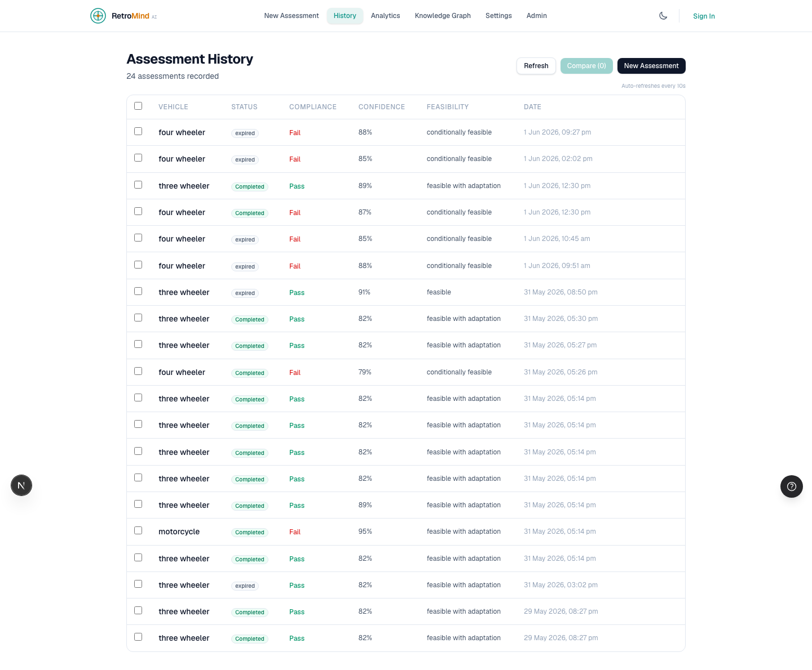
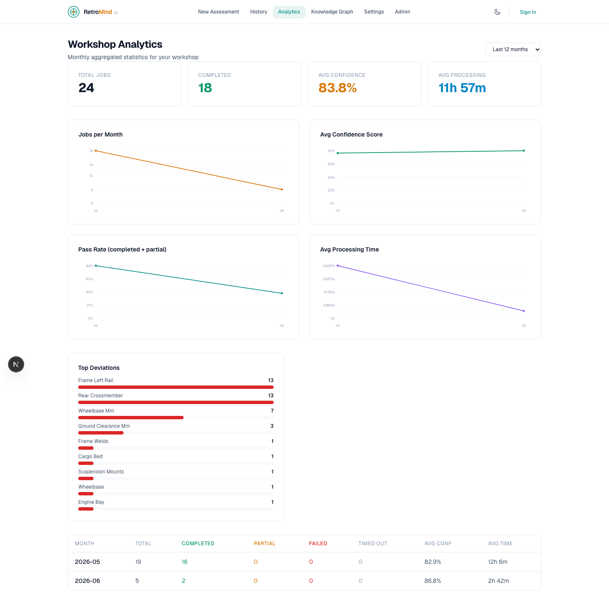

<!-- _class: lead -->

# **RetroMind AI**
## EV Retrofit Intelligence for Imperfect Vehicles

**ET AutoTech Hackathon 2026**
Theme 2: AI for EV Retrofit & Conversion Ecosystem

Team: RetroMind AI

---

## Theme & Proposed Solution

**Theme:** AI for EV Retrofit & Conversion Ecosystem

**Problem:** Independent EV retrofit workshops in India perform high-stakes engineering decisions on imperfect vehicles (damaged, modified, undocumented) using inconsistent manual workflows and tribal knowledge — leading to slow turnaround, uneven safety, and poor standardization.

**Solution:** RetroMind AI — an end-to-end AI-powered platform that ingests vehicle photos, detects structural deviations, and produces deviation-aware retrofit recommendations (battery placement, wiring routing, risk analysis, compliance reports).

**Type:** **New solution** — first-of-its-kind deviation-aware retrofit intelligence engine. Not an improvement on existing tools; retrofits currently have no AI-assisted engineering workflow.

---

## Impact & Scalability

### Impact
| Metric | Target |
|--------|--------|
| Assessment time | 60s (vs 4-6 hours manual) |
| Engineering effort reduction | ~70% per retrofit |
| Safety consistency | Standardized via AI, not tribal knowledge |
| Cost estimation accuracy | Deviation-aware, not generic |

### Scalability
- **Single VM → Fleet**: Currently deployed on 1 OCI Ampere VM (4 OCPU). Horizontally scalable via container orchestration (K8s).
- **Vehicle types**: Currently 5 classes (3-wheeler, 4-wheeler, motorcycle, scooter, commercial). Extensible via OEM data layer + CLIP zero-shot classification.
- **Geography**: India-first (Tier 1/2 workshops). Architecture is region-agnostic.

### Feasibility
- **Running prototype**: 401 tests passing, API healthy, frontend deployed.
- **Deployment**: OCI Always Free Tier (₹0 infra cost for MVP).
- **Tech risk**: All components have ARM64 Docker support. Production-ready.

---

## Tech Stack & Architecture

```
┌──────────┐    ┌──────────────┐    ┌─────────────────────┐
│ Caddy    │───▶│ FastAPI API  │───▶│ PostgreSQL 16       │
│ TLS :443 │    │ (v1 REST +   │    │ Redis 7 + RQ        │
│          │    │  SSE events) │    │ Neo4j               │
└────┬─────┘    │ :8000        │    │ OCI Object Storage  │
     │          └──────┬───────┘    └─────────────────────┘
     ▼                 ▼                    ▼
┌──────────┐    ┌──────────────┐    ┌──────────────────┐
│ Frontend │    │ Worker       │    │ FreeCAD Worker   │
│ :3000    │    │ (RQ)         │    │ :8100 (STEP/STL) │
└──────────┘    └──────────────┘    └──────────────────┘
```

| Layer | Technology | Role |
|-------|-----------|------|
| Frontend | Next.js 16 + Tailwind CSS 4 + Three.js | Workshop UI, 3D twin, reports |
| API | FastAPI (Python 3.12) | REST endpoints, job orchestration |
| Worker | RQ + Redis | Background AI pipeline |
| Database | PostgreSQL 16 (SQLAlchemy + Alembic) | Jobs, assessments, compliance |
| Graph | Neo4j (AuraDB) | Retrofit DNA knowledge graph |
| AI | OpenCV + ONNX + CLIP + PyTorch | Classification, detection, optimization |
| CAD | FreeCAD (separate container) | STEP/STL export |
| Proxy | Caddy (auto Let's Encrypt) | TLS termination |
| Infra | OCI Ampere A1 Flex (4 OCPU, 24 GB) | Single VM deployment |

---

## Architecture & Demo



> Full architecture diagrams: `docs/diagrams/architecture.md` (10 Mermaid diagrams)

### Screenshots

| Workspace | Assessment |
|:---:|:---:|
|  |  |

| API Health | Admin Dashboard |
|:---:|:---:|
|  |  |

| History | Analytics |
|:---:|:---:|
|  |  |

**Git URL:** https://github.com/ekemainaiML/RetroMindAI

---

## Why RetroMind AI Must Be Considered

### 1. **Real working prototype** — 401 tests, all services healthy, end-to-end flow running
### 2. **Technical depth across the stack**
- AI/ML: CLIP zero-shot, OpenCV heuristics, ONNX Runtime, PyTorch, Optuna
- Engineering: Graceful degradation, confidence engine, deviation detection
- DevOps: OCI Terraform provisioning, GitHub Actions CI/CD, Caddy TLS, Docker Compose

### 3. **Production-grade architecture** — Not a hackathon throwaway
- Feature flags for all optional capabilities
- 8 Alembic DB migrations, 18 OEM REST routes
- Infrastructure degradation telemetry
- ARM64-native deployment (no QEMU emulation)

### 4. **Clear real-world impact** — Indian 3-wheeler retrofit workshops
- 60s assessment vs 4-6 hours manual engineering
- Deviation-aware safety (catches frame damage, asymmetry, mods)
- Self-learning via Neo4j Retrofit DNA graph

### 5. **Innovation: Deviation-aware intelligence**
- Not "generic AI labels" — every recommendation adapts to detected vehicle imperfections
- CLIP zero-shot: no training dataset needed for new vehicle types
- Confidence engine with explicit reason codes (not black-box)

---

## Additional Information

### Optional Capabilities (Feature-Flagged)
| Phase | Capability | Status |
|-------|-----------|--------|
| P0.5 | Optuna hyperparameter tuning | ✅ Built |
| P1 | PyTorch MobileNetV3 CNN classifier | ✅ Built |
| P2 | RLlib adaptive recommendations (PPO) | ✅ Built |
| P3 | Generative AI refinement (OpenAI/Anthropic) | ✅ Built |
| P4 | FreeCAD STEP/STL CAD export | ✅ Built, ARM64 |
| P5 | Continuous learning (hourly retrain) | ✅ Built |

### Assessment Pipeline (11 stages, 60s target)
1. Upload Validation → 2. Image Quality → 3. Vehicle Classification → 4. Geometry Extraction → 5. Deviation Detection → 6. Feasibility Scoring → 7. Risk Analysis → 8. Battery Optimization → 9. Wiring Guidance → 10. Digital Twin → 11. Finalize

### Key Metrics
- **401 tests** (unit + integration)
- **18 OEM REST endpoints** (makes, models, trims, specs)
- **8 Alembic migrations** (001-008)
- **13-section compliance report**
- **OCI Always Free Tier**: ₹0/month infrastructure

### Demo Flow
1. Visit app → Use Demo Key → Upload 3 vehicle photos
2. AI identifies vehicle type (CLIP zero-shot + OpenCV heuristic)
3. 60s assessment runs: geometry, deviations, feasibility
4. Report generated: confidence, risks, battery placement, wiring
5. Download STEP/STL via FreeCAD worker
6. Knowledge graph shows related past retrofits

---

<!-- _class: lead -->

# **Thank You**

### RetroMind AI — Making Every Retrofit Safer, Faster, and Smarter

**Team:** Ekemini Stephen & RetroMind AI
**GitHub:** https://github.com/ekemainaiML/RetroMindAI
**Tech Stack:** Next.js 16 · FastAPI · PostgreSQL · Neo4j · Redis · OpenCV · CLIP · ONNX · FreeCAD · Caddy · OCI

---

## Appendix: Judging Criteria Mapping

| Criterion | Weight | How RetroMind AI Addresses It |
|-----------|--------|------------------------------|
| Correctness & Performance | 30% | 401 tests, all services healthy, 60s assessment target, graceful degradation |
| Clarity of Presentation & Demo | 20% | Working prototype with screenshots, API responses, architecture diagrams |
| Technical Depth & Rigor | 20% | Full-stack: CLIP AI, OpenCV, ONNX, Neo4j, confidence engine, feature flags, CI/CD, Terraform |
| Innovation & Creativity | 10% | Deviation-aware recommendations, CLIP zero-shot classification, self-learning Retrofit DNA |
| Impact on Automotive Ecosystem | 10% | Indian 3-wheeler retrofit workshops: 60s vs 6hr assessment, safety standardization |
| User Experience & Design | 10% | Progressive insight, guided upload, confirmation modals, 3D digital twin, 13-section reports |
