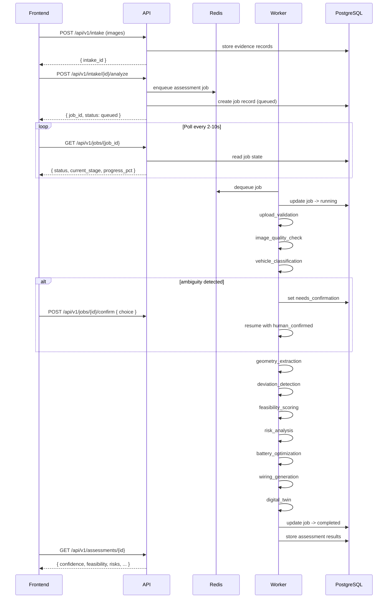
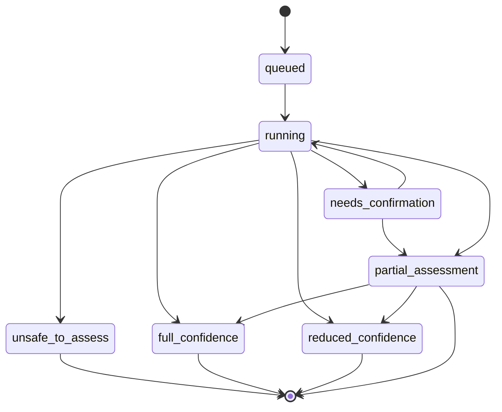
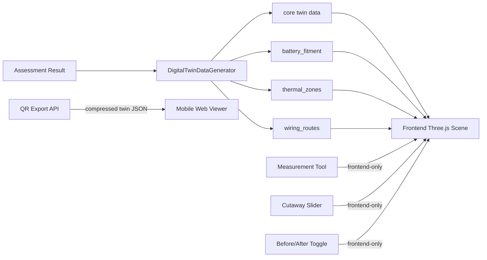

# RetroMind AI — Technical Specification

## 1. Overview

### 1.1 Product
RetroMind AI: a self-learning EV retrofit intelligence network for imperfect real-world vehicles.

### 1.2 Launch Wedge
- Primary customer: Independent EV retrofit workshops (India Tier 1/Tier 2)
- Initial vehicle anchor: ICE auto-rickshaw (3-wheeler) -> EV conversion
- Demo mode: Single-tenant (implicit `demo-workshop` context)

### 1.3 Guiding Principles
- Production-grade architecture, not throwaway prototype
- Human-in-the-loop for critical decisions
- Graceful degradation over hard failure
- Confidence-aware outputs with explicit reason codes
- Progressive insight delivery (staged results)
- Explainability at every output boundary

### 1.4 Timing SLAs
| Metric | Target | Hard Max |
|--------|:-----:|:--------:|
| First feasibility result (normal) | 60s | 120s |
| Soft timeout warning | 90s | — |
| Hard timeout (terminate + salvage) | — | 120s |
| Auto-retry (one attempt) | — | +120s |

---

## 2. Architecture

### 2.1 Stack

| Layer | Technology | Purpose |
|-------|-----------|---------|
| Frontend | Next.js 16 + Tailwind CSS 4 | Workshop UI, progressive insight, confirmation modals |
| Visualization | Three.js / React Three Fiber | Digital twin, risk overlays, battery placement zones |
| Backend API | FastAPI | REST endpoints under `/api/v1/...`, job orchestration |
| Worker | RQ + Redis | Background inference tasks, queue management |
| AI Runtime | ONNX Runtime + OpenCV + CLIP (transformers) | Classification, geometry extraction, deviation detection |
| Optimization | Template-based | Battery placement, wiring guidance |
| Primary DB | PostgreSQL 16 | Jobs, assessments, risks, compliance reports, entity state |
| Knowledge Graph | Neo4j (AuraDB Free Tier) | Retrofit DNA, cross-retrofit similarity, pattern learning |
| Object Storage | OCI Object Storage (S3-compatible) | Vehicle images, assessment artifacts, report exports |
| Reverse Proxy | Caddy | Let's Encrypt auto TLS, frontend + API routing |

---

## 3. Bounded Contexts

### 3.1 Context Map (v1)

| Context | Responsibility | Top-Level |
|---------|---------------|:---------:|
| `intake` | Evidence upload, validation, slot management | Yes |
| `jobs` | Async job lifecycle, polling, timeout, retry | Yes |
| `assessments` | Confidence scoring, deviation detection, risk analysis | Yes |
| `recommendations` | Battery placement, wiring guidance | Yes |
| `reports` | Compliance report generation (13-section canonical) | Yes |
| `intelligence_graph` | Retrofit DNA, similarity queries, pattern learning | Yes |
| `shared` | Common enums, base models, utilities | Yes |
| `risks` | Risk record management (subdomain of `assessments`) | No |
| `compliance` | Compliance state tracking (subdomain of `assessments`) | No |
| `retrofits` | Retrofit lifecycle management (deferred to v2) | No |

Workflow composition for v1: `intake -> assessment -> recommendation -> report`

---

## 4. Workflow States and Enums

### 4.1 Assessment Confidence States

| State | Range | Behavior | Recommendations |
|-------|:-----:|----------|:--------------:|
| `full_confidence` | 85-100 | Full output; all recommendations enabled | All |
| `reduced_confidence` | 70-84 | Full output with caution labels; confidence reasons visible | All, with caveats |
| `partial_assessment` | 50-69 | Limited output; preliminary feasibility only | Preliminary only; strong blocked |
| `unsafe_to_assess` | 0-49 | No recommendation; required actions to proceed | None blocked |

### 4.2 Confidence Score Weights

| Factor | Weight | Source |
|--------|:-----:|--------|
| Completeness | 30% | Mandatory view satisfaction ratio |
| Quality | 20% | Image quality (blur, exposure, occlusion) |
| Visibility | 20% | Structural coverage adequacy |
| Classification | 10% | Model confidence in vehicle class |
| Geometry | 10% | Geometry extraction consistency |
| Deviation Certainty | 10% | Confidence in detected deviation signals |

### 4.3 Safety Override Rules

Safety overrides SHALL force state downgrade regardless of aggregate score:

- **Forced `partial_assessment`**: missing 1 of 3 mandatory views after 3 retry attempts; moderate geometry conflict unresolved.
- **Forced `unsafe_to_assess`**: missing >=2 mandatory views; severe contradiction (classifier < 40 AND geometry < 40 AND weak mandatory views); repeated timeout without meaningful partial result.

### 4.4 Job States

```
queued -> running -> completed
                   -> partial_complete
                   -> failed
                   -> timed_out
       -> retrying -> running (second attempt)
                    -> partial_complete
                    -> timed_out
                    -> failed
queued -> cancelled
```

**Enum**: `queued`, `running`, `retrying`, `completed`, `partial_complete`, `failed`, `timed_out`, `cancelled`

### 4.5 Assessment Stages (Progressive Disclosure)

```
upload_validation -> image_quality_check -> vehicle_classification -> geometry_extraction -> deviation_detection -> feasibility_scoring -> risk_analysis -> battery_optimization -> wiring_generation -> digital_twin -> finalizing
```

### 4.6 Recommendation Status

| Status | Meaning |
|--------|---------|
| `feasible` | Safe conversion recommended under standard constraints |
| `feasible_with_adaptation` | Conversion feasible with deviation-aware modifications |
| `limited_feasibility` | Partial recommendation; insufficient evidence for full confidence |
| `unsafe_to_recommend` | Cannot recommend safely; blocking conditions met |

### 4.7 Risk Severity

| Severity | Meaning | Blocks? |
|----------|---------|:-------:|
| `low` | Minor observation; no material impact | No |
| `medium` | Notable finding; requires consideration | No |
| `high` | Significant risk; mitigation required | Only if >=3 escalate |
| `critical` | Safety-critical; blocks recommendation | Yes |

**Escalation rule**: 3 or more `high` risks SHALL escalate to critical system risk state and block all recommendations.

### 4.8 Compliance State Vocabulary

| State | Meaning |
|-------|---------|
| `not_assessed` | Compliance verification not yet run |
| `pass` | All mandatory compliance checks passed |
| `pass_with_caveats` | Passed with advisory observations |
| `fail` | One or more mandatory checks failed |
| `insufficient_evidence` | Cannot determine compliance from available data |

---

### 4.9 Digital Twin Visualization Features

The digital twin has two tiers of functionality:

**Standard** (always available, existing):
- Procedural 3D vehicle model (body, cabin, windshield, cargo bed, wheels)
- Deviation overlays (colored pulsing boxes per detected anomaly)
- Retrofit component markers (colored boxes with wireframe edges)
- Hover tooltips on components
- Click-to-inspect selection panel
- CAD export (STEP/STL via FreeCAD worker container)

**Enterprise** (additive, activated by new data fields in `DigitalTwinDataGenerator.generate()`):

| Feature | Data Field | Backend Input | Frontend Component |
|---------|-----------|---------------|-------------------|
| Battery pack fitment | `battery_fitment` | `battery_placement` from assessment | `BatteryFitmentOverlay` with clearance zones |
| Measurement tools | *(frontend-only)* | — | Measurement mode with point/line/distance |
| Heat zone overlays | `thermal_zones` | Vehicle type + deviation heat notes | Translucent spheres with temperature gradient |
| Wiring routes | `wiring_routes` | `wiring_guidance` from assessment | 3D tube spline through waypoints |
| Cutaway controls | *(frontend-only)* | — | Opacity slider on body meshes |
| Before/After toggle | *(frontend-only)* | — | View state switching deviations ↔ components |
| QR export | `POST /api/v1/digital-twin/{id}/qr` | Compressed twin data | QR code → mobile web viewer |

All enterprise features default to inactive (`null`/`[]`/hidden) when data is absent. The existing scene renders unchanged.

See `docs/digital-twin-enhancement-plan.md` for detailed implementation specifications.

---

## 5. PRD-to-Component Mapping

| PRD Epic | Spec Component | Deliverable |
|----------|---------------|-------------|
| Guided First-Run Retrofit Intake | `intake` context + `frontend/` | Upload UI, slot validation, guidance cards |
| Vehicle Intelligence & Deviation Detection | `ai/*` modules + `assessments` context | Classification, geometry, deviation engines |
| Feasibility & Risk Decisioning | `assessments` context + confidence engine | Feasibility scoring, risk records, state machine |
| Adaptive Retrofit Recommendations | `recommendations` context + `optimization/*` | Battery placement, wiring guidance |
| Progressive Insight & Explainability | `jobs` context + frontend polling | Stage progression, digital twin, overlays |
| Graceful Degradation & Guided Recovery | `core/` failure logic + frontend | Degradation logic, fallback UX, recovery prompts |
| Retrofit Intelligence Continuity | `intelligence_graph` context | Neo4j Retrofit DNA records, similarity queries |
| **Enterprise 3D Digital Twin** | `ai/digital_twin/` + frontend Three.js | Battery fitment, measurements, heat zones, wiring routes, cutaway, before/after, QR viewer |

---

## 6. Async Job Contract

### 6.1 Transport
- v1: polling (`GET /api/v1/jobs/{job_id}`)
- v1.5: SSE upgrade via transport abstraction
- v2+: WebSockets (deferred)

### 6.2 Polling Backoff

| Interval | Cadence |
|----------|:-------:|
| 0-15s | Every 2s |
| 15-60s | Every 5s |
| 60-120s | Every 10s |
| >120s | Stop (timed out) |

### 6.3 Job Response Shape

```json
{
  "job_id": "uuid",
  "status": "running",
  "current_stage": "deviation_detection",
  "progress_pct": 45,
  "assessment_state": null,
  "timed_out": false,
  "completed_stages": ["vehicle_classification", "geometry_extraction"],
  "missing_stages": [],
  "infrastructure_degradation": [],
  "retry_available": false,
  "created_at": "2026-05-24T10:00:00Z",
  "updated_at": "2026-05-24T10:00:45Z"
}
```

### 6.4 Async Flow



---

## 7. API Contracts

### 7.1 Intake API

```
POST /api/v1/intake
Content-Type: multipart/form-data

{
  "workshop_id": "demo-workshop",
  "left_side_profile": <file>,
  "right_side_profile": <file>,
  "rear_view": <file>,
  "front_view": <file?> (optional),
  "engine_bay": <file?> (optional),
  "underbody": <file?> (optional)
}

-> 201
{
  "intake_id": "uuid",
  "status": "validating",
  "missing_views": [],
  "low_quality_views": []
}
```

**Mandatory views**: `left_side_profile`, `right_side_profile`, `rear_view`
- if 3/3 valid -> eligible to score; 2/3 -> `partial_assessment`; <2 -> `unsafe_to_assess`

```
PUT /api/v1/intake/{intake_id}/views/{view_slot}
Content-Type: multipart/form-data

{ "file": <file> }

-> 200 { "intake_id": "...", "view_slot": "left_side_profile", "status": "received" }
```

### 7.2 Job API

```
POST /api/v1/intake/{intake_id}/analyze

-> 200
{
  "confidence_factors": {
    "completeness": 90,
    "quality": 75,
    "visibility": 80,
    "classification": 85,
    "geometry": 70,
    "deviation_certainty": 65
  },
    "alternatives": [
      { "type": "motorcycle", "confidence": 0.12 }
    ]
  },
  "deviation_summary": {
    "anomalies_detected": 3,
    "severity": "medium",
    "top_issues": [
      {
        "type": "asymmetry",
        "location": "frame_left_rail",
        "severity": "medium",
        "confidence": 0.78
      }
    ]
  },
  "feasibility_score": 72,
  "feasibility_label": "feasible_with_adaptation",
  "risk_summary": {
    "system_risk_state": "elevated",
    "critical_count": 0,
    "high_count": 2,
    "medium_count": 4,
    "low_count": 3
  },
  "risks": [
    {
      "id": "uuid",
      "category": "structural",
      "severity": "high",
      "message": "Frame asymmetry detected in left rail",
      "recommendation": "Inspect and reinforce left frame rail",
      "blocking": false,
      "confidence": 0.78
    }
  ],
  "infrastructure_degradation": [
    {
      "service": "neo4j",
      "severity": "medium",
      "fallback": "heuristic_recommendation_engine"
    }
  ],
    "zones": [
      {
        "id": "A",
        "priority": 1,
        "position": "under_seat_forward",
        "constraints": ["max_width_420mm", "max_height_180mm"]
      }
    ],
}
```

### 7.6 Report API

```
GET /api/v1/reports/{assessment_id}
-> 200 { /* 13-section compliance report */ }
```

---

## 8. Compliance Report Schema (13 Mandatory Sections)

1. **Assessment Metadata** — assessment_id, intake_id, workshop, vehicle, timestamps
2. **Vehicle Classification** — detected type, confidence, `human_confirmed` flag, alternatives
3. **Evidence Summary** — views submitted, quality per view, missing, occluded, enhanced flags
4. **Structural Findings** — geometry quality, anomaly regions, asymmetry detections
5. **Deviation Analysis** — detected deviations, severity, location, confidence per finding
6. **Confidence Report** — aggregate score, per-factor breakdown, reason codes, safety overrides
7. **Feasibility Decision** — score, label, supporting rationale, blocking conditions, adapted recommendations
8. **Risk Register** — all risks with category, severity, message, recommendation, blocking flag, confidence
9. **Battery Placement Recommendation** — primary zone, alternates, adaptation notes, constraint diagram
10. **Wiring Guidance** — primary routing path, caution zones, confidence, limitation reasons
11. **Compliance Status** — state, mandatory check results, advisory observations
12. **Infrastructure Degradation** — services degraded, fallback used, impact on output quality
13. **Recommendation Summary** — recommendation status, key actions for workshop, safety constraints, next steps

---

## 9. Confidence Engine

### 9.1 Score Calculation

```
confidence_score = Sigma(weight_i x score_i)

weight_completeness   = 0.30
weight_quality        = 0.20
weight_visibility     = 0.20
weight_class          = 0.10
weight_geometry       = 0.10
weight_deviation      = 0.10
```

### 9.2 Score Modifiers

- **Human confirmation**: raw_classification_confidence -> effective_confidence (e.g., 58 -> 75)
- **Safety overrides**: force state change regardless of aggregate score
- **Infrastructure degradation**: subtract up to 15 points per active Tier 1 degradation

### 9.3 State Machine



---

## 10. AI Conflict Resolution

### 10.1 Priority
1. Human confirmation (recoverable ambiguity)
2. Auto-correction (if obvious, e.g., left/right swap)
3. Partial downgrade (`partial_assessment`)
4. Unsafe refusal (`unsafe_to_assess`)

### 10.2 Case Table

| Condition | Classification Conf | Geometry | Views | Action | Result State |
|-----------|:------------------:|:--------:|:-----:|--------|:------------:|
| Recoverable ambiguity | 50-84 | moderate conflict | >=2/3 mandatory valid | Human confirmation prompt | `reduced_confidence` or `full_confidence` |
| Unresolved conflict | any | any | any | Auto-downgrade after timeout | `partial_assessment` |
| Severe contradiction | < 40 | < 40 | < 2/3 mandatory | Safety override | `unsafe_to_assess` |

### 10.3 Human Confirmation Pattern

UX: Modal / inline decision card with constrained selection (radio buttons). Never free-text.

```text
Vehicle classification uncertain

RetroMind detected conflicting signals.

Detected possibilities:
  1. Three-Wheeler (58%)
  2. Modified Motorcycle (31%)

Potential cause:
  - Structural modification
  - Image inconsistency
  - Non-standard geometry

Please confirm vehicle type:

( ) Three-Wheeler
( ) Motorcycle
( ) Re-upload Photos
```

After confirmation, `effective_confidence` is boosted (e.g., 58 -> 75) and tagged `human_confirmed: true` for explainability. Report line: "Vehicle classification was manually confirmed due to model ambiguity."

---

## 11. Failure Mode Integration

Failure behavior is defined fully in `docs/failure_modes.md`. Summary by category:

| Category | Primary Fallback | Hard Limit |
|----------|-----------------|:----------:|
| Input failures | Re-upload prompt, continue with reduced confidence | 3 attempts per view -> `unsafe_to_assess` |
| AI inference failures | Human confirmation prompt | -> `partial_assessment` -> `unsafe_to_assess` |
| Async job timeouts | Partial results (if meaningful); auto-retry once | 120s hard timeout |
| Infrastructure failures | Tiered: graceful degrade (T1) / hard fail (T0) | Per Tier 0-3 policy |
| Safety/recommendation failures | Only `critical` blocks; >=3 `high` escalate | -> `unsafe_to_recommend` |
| UX edge cases | Latest upload wins; server-side continuation | 30-min resume TTL |
| Concurrency | Block concurrent; allow same-intake edits | 1 active job per workshop |

---

## 12. UX Design Decisions

### 12.1 First-Run Experience
- Guided engineering workspace (not analytics dashboard)
- Single dominant CTA to start a retrofit
- Clear statement of workflow outcomes
- First-run guidance for empty state

### 12.2 Upload Workflow
- Requested views: front, left, right, rear, engine/battery bay
- **Mandatory**: left_side_profile, right_side_profile, rear_view
- **Optional**: front_view, engine_bay, underbody
- Each view has capture guidance (angle/coverage)
- Missing mandatory views -> recovery guidance + continue-with-limited-analysis path
- Up to 3 re-upload attempts per mandatory view before `unsafe_to_assess`

### 12.3 Progressive Insight
- Milestones: vehicle identified -> structural scan -> feasibility -> adaptive recommendation -> twin view
- Each milestone renders as available
- Prior completed stages remain visible if later stage fails

### 12.4 Confirmation Pattern
- Modal/inline decision card with constrained selection
- Never free-text ("What vehicle is this?")
- Example: "Auto Rickshaw (58%) / Motorcycle (31%) / Re-upload Photos"
- 60s timeout if operator does not respond -> `partial_assessment`

### 12.5 Timeout UX
- 90s soft: "Analysis is taking longer than expected. Continuing..."
- 120s hard: "RetroMind is retrying automatically..." or partial results card
- Failed retry: specific missing stages listed with retry button for advanced analysis

### 12.6 Infrastructure Degradation UX
- Explain degradation in plain language: "Retrofit intelligence memory temporarily unavailable. Assessment completed using local engineering rules."
- Never say "something failed"

### 12.7 Concurrent Assessment UX
- If active job exists: "An assessment is already running. Current: 3-Wheeler Intake #12 — Progress: 62%. [ View Current ] [ Cancel & Start New ]"

---

## 13. System-Level Acceptance Criteria

1. **Intake validation** SHALL require 3/3 mandatory views for eligibility; 2/3 -> `partial_assessment`; <2 -> `unsafe_to_assess`
2. **Confidence scoring** SHALL compute weighted aggregate with explicit factor breakdown
3. **Safety overrides** SHALL force state downgrade when conditions are met
4. **Human confirmation** SHALL be prompted for recoverable model disagreement
5. **Unresolved conflict** SHALL downgrade to `partial_assessment` with reason code `unresolved_model_conflict`
6. **Severe contradiction** SHALL trigger `unsafe_to_assess` without human prompt
7. **Async jobs** SHALL complete within 120s hard timeout with stage-aware recovery
8. **Partial results** SHALL be returned when meaningful completed stages exist (minimum: classification + geometry + deviation)
9. **Infrastructure degradation** SHALL follow Tier 0-3 per-service policy
10. **Concurrent assessments** SHALL be blocked; same-intake re-analysis SHALL be allowed
11. **Re-uploads** SHALL replace previous slot; re-analysis SHALL trigger automatically
12. **Tab close** SHALL NOT cancel jobs; 30-min resume window SHALL apply
13. **Recommendations** SHALL be blocked only by `critical` severity or >=3 `high` escalated
14. **Compliance reports** SHALL contain all 13 mandatory sections
15. **API** SHALL use `/api/v1/...` routes with polling-only async transport

---

## 14. Digital Twin Visualization Architecture

### 14.1 Data Flow



### 14.2 New API Endpoints

```
GET  /api/v1/digital-twin/{assessment_id}/qr
     -> 200 image/png (QR code)
     -> 404 (no twin data available)
```

### 14.3 DigitalTwinData Response Shape (Extended)

```json
{
  "vehicle_type": "three_wheeler",
  "dimensions": { "length": 2800, "width": 1200, "height": 1700 },
  "deviations_3d": [ ... ],
  "retrofit_components": [ ... ],
  "view_angles": { "default_camera": { ... } },

  "battery_fitment": {
    "zone_id": "A",
    "position": { "x": 0, "y": -0.25, "z": 0.15 },
    "size": { "w": 0.6, "h": 0.22, "d": 0.4 },
    "clearance": { "front": 15, "rear": 20, "left": 10, "right": 10, "top": 25, "bottom": 30 },
    "fitment_status": "clear" | "tight" | "conflict",
    "label": "48V LiFePO4 Battery Pack"
  },

  "thermal_zones": [
    {
      "id": "exhaust_area",
      "label": "Exhaust / Engine Bay",
      "position": { "x": 0, "y": -0.1, "z": -0.5 },
      "radius": 0.35,
      "severity": "high",
      "temperature_c": 120,
      "source": "oem_default"
    }
  ],

  "wiring_routes": [
    {
      "id": "primary_route",
      "label": "Primary HV Route",
      "waypoints": [{ "x": 0, "y": 0, "z": 0 }, ...],
      "color": "#f59e0b",
      "caution_zones": [],
      "confidence": 0.85
    }
  ]
}
```

### 14.4 Frontend Architecture

```mermaid
flowchart TD
    A[DigitalTwinScene] --> B[DigitalTwinSceneContent]
    B --> C[buildRickshawModel]
    B --> D[buildDeviationOverlays]
    B --> E[buildRetrofitComponents]
    B --> F[BatteryFitmentOverlay]
    B --> G[buildThermalZones]
    B --> H[buildWiringRoutes]
    B --> I[MeasurementTool]
    B --> J[CutawaySlider]
    B --> K[BeforeAfterToggle]
    C --> L[THREE.Group]
    D --> M[THREE.Mesh[] - deviations]
    E --> N[THREE.Mesh[] - components]
    F --> O[THREE.Mesh - battery clearance]
    G --> P[THREE.Mesh[] - heat spheres]
    H --> Q[THREE.Mesh - wiring tubes]
    I --> R[THREE.Points + Lines]
    J --> S[opacity control]
    K --> T[visibility toggle]
```

### 14.5 Scene Toolbar

All toggleable features are exposed via a toolbar rendered above the 3D scene:

| Control | Type | Default |
|---------|------|---------|
| View mode (Before / After) | Segmented toggle | Before |
| Battery fitment | Toggle button | Off |
| Heat zones | Toggle button | Off |
| Wiring routes | Toggle button | Off |
| Measurement mode | Toggle button | Off |
| Body opacity | Range slider (10-100%) | 100% |
| Reset camera | Button | — |

### 14.6 Performance Targets

| Metric | Target | Notes |
|--------|:------:|-------|
| Scene load time | < 500ms | From twin data received to rendered frame |
| Toggle response | < 50ms | Visibility changes are instant |
| Measurement calculation | < 10ms | Distance computation is O(1) |
| QR generation | < 1s | Including compression + image encoding |
| Mobile viewer load | < 2s | On 4G, with compressed twin JSON (~2-5 KB gzipped) |

### 14.7 Acceptance Criteria (Enterprise Features)

1. **Battery fitment** SHALL render the battery pack at the correct position with clearance wireframe and fitment status color; SHALL be toggleable via toolbar button
2. **Measurement tools** SHALL support point-and-click distance measurement with mm-precision display; SHALL coexist with orbit controls via mode toggle
3. **Heat zones** SHALL render translucent gradient spheres at known heat source positions; SHALL be toggleable
4. **Wiring routes** SHALL render 3D splines through waypoints with caution zone indicators; SHALL be toggleable
5. **Cutaway controls** SHALL adjust body mesh opacity from 10-100% without affecting components or deviations
6. **Before/After toggle** SHALL switch between deviation-visible (Before) and component-visible (After) states
7. **QR export** SHALL generate a scannable QR code linking to a mobile-responsive web viewer rendering the same twin data
8. **All new fields** SHALL be optional; existing scene SHALL render unchanged when they are absent
9. **All existing tests** SHALL continue to pass without modification
